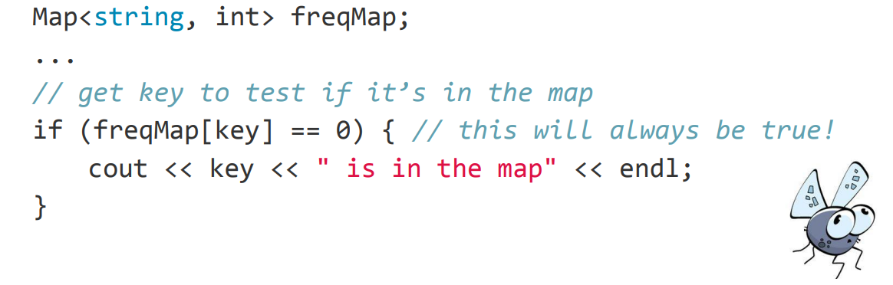
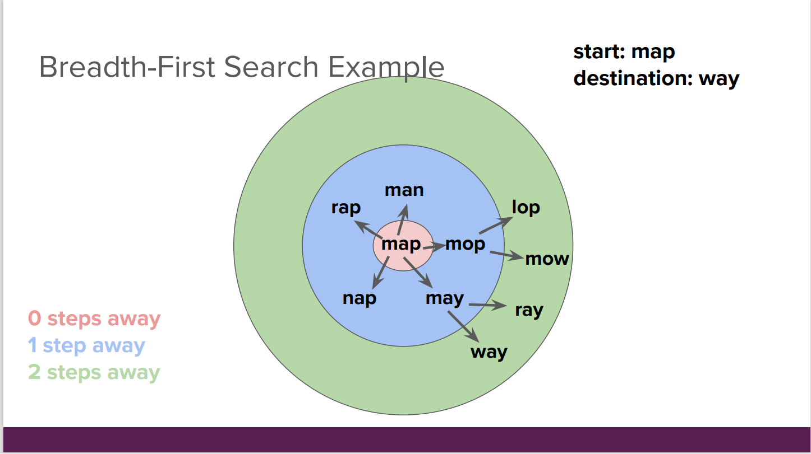
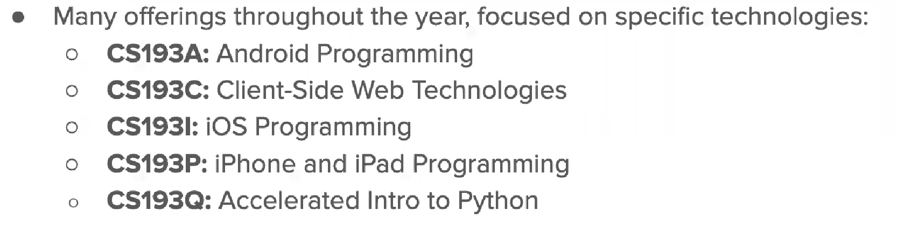
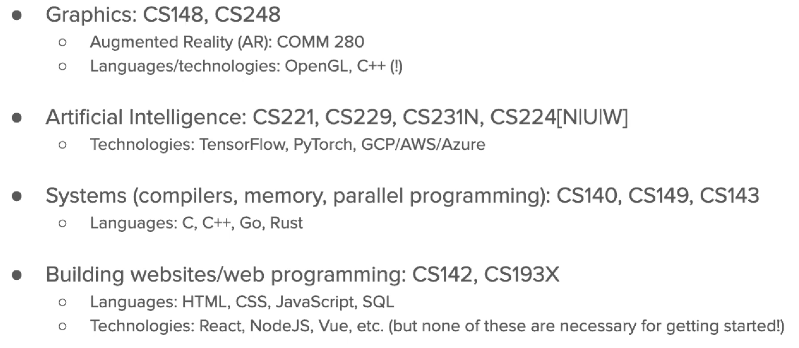

[2020夏季 斯坦福大学 MIT CS106B C++ 抽象编程_哔哩哔哩_bilibili](https://www.bilibili.com/video/BV1Hr4y137Do?p=4&vd_source=63731e51187044a6065a97ae72adb12e)

2020课程网站 [CS106B Home (stanford.edu)](https://web.stanford.edu/class/archive/cs/cs106b/cs106b.1208/)

assignments 不可以提交，需要学生账户登录

2020的课程assignment starter code链接过期，所以拿2022 summer的课程作业做

summer 和 winter好像不是同样的teacher所以大致安排和内容有区别

## Assignment 0

配置qt以及debug教程，可以直接上手

## Lecture 1-3

c++基础，与c大致相同，快速掠过

## Lecture 4

#### getLine()

get input from console

```cpp
string input = getLine("Enter a number");//#include"simpio.h"
```

#### vectors

```cpp
#include<vector.h>
Vector<int> vec = {1,2,3}; //quick initializer
vec.add(2);
cout << vec[1] << endl;//use index to get the number
/*output : 2 (start from zero like list/array) */
vec.remove(0)
//remove elements at position zero,all other elements will be moved forward
vec.size() //get the size of a vector
vec.insert(index,value)
vec.clear()
vec.sort()//sort the elements in increasing order
```

vectors can use for each to iterate 

for each can be used in cpp similar to java

#### pass by reference

similar to c , the value of sth. passed into a function is passed by value unless written in reference

```cpp
double weight = 3.0;
void increaseWight(double& weightRef){
    weightRef *= 3;
}
increaseWight(weight);//only need to change function passed value
//only pass reference not real value
//wrong : increaseWight(3.5);
```

when data is small we can use copies to pass back instead

advantage of using reference is reducing time

## Assignment 1

听完Lecture 1-3做perfect number, 听完Lecture 4做soudex

debug : don't use length in a changing ~~array?~~ while looping

## Lecture 5

#### Grid(Stanford Library)

```cpp
//one way to define
Grid<int> board;
board.resize(3,3);//must be resize before use
board[0][0] = 2;//2-D Array
//another way to define(needless to resize)
Grid<int> board(3,3);

grid.numRows()
grid.numCols()//tell you how many rows and cols in grid
grid.inBounds(row,col)//boolean type
```

#### Queue(Stanford library)

```cpp
Queue<int> line;
line.enqueue(42);
line.enqueue(13);//add elements into queue
cout << line.dequeue() << endl;//remove the first
cout << line.peek() << endl; //see the first without removing
.size()
Queue<int> line = {1,-4,5}//another way to initialize
```

#### Stack(Stanford library)

```cpp
Stack<int> stack;
stack.push(value);//or add(value)
stack.pop(value);//or remove(value)
stack.peek();//or top()
stack.isempty();
.size()
```

**Important bug warning: don't use .size() while looping in the structure since the size is changing!!!**

## Lecture 6

#### Sets(Stanford library)

```cpp
.add(value)
.contains(value)
.remove(value)
.size()
.isEmpty()

s1 == s2 //true if two sets have same elements
s1 + s2 //add two sets (all the elements)
s1 * s2 //elements in both s1 and s2
s1 - s2 //elements in s1 but not in s2
```

#### Map(Stanford library)

* **m.clear()** : removes all key/value pairs from the map
* **m.containsKey(key)** : returns true if the map contains a value for the given key
* **m.get(key)** : returns the value associated with key in this map. If key is not found,  
  get returns the default value for ValueType.
* **m.isEmpty()** : returns true if the map contains no key/value pairs (size 0)
* **m.keys()** : returns a Vector copy of all keys in the map
* **m[key] = value**
* **m.put(key, value)** : adds a mapping from the given key to the given value; if the  
  key already exists, replaces its value with the given one
* **m.remove(key)** : removes any existing mapping for the given key (ignored if the  
  key doesn't exist in the map)
* **m.size()** : returns the number of key/value pairs in the map
* **m.values()** : returns a Vector copy of all the values in the map

```cpp
Map<string,string> phonebook;

Map<string,Vector<double>> counts;
```

**bug warning:**



use *.containsKey(key)*  instead

## Lecture 7 

breadth first search:



## Assignment 2

根据文档做完通过测试即可

## Lecture 8

**make sure to differentiate references and copies**

big O notation is known already(quick skip)

## Lecture 9-14

lecture 9 is about the defination of recursion(nothing new/skip)

lecture 10 has a new part of graph

lecture 14 **comparison between BFS & DFS:**

bfs can always find the shortest path

dfs uses less memory

## Assignment 3（待查）

part 1/section 2 : brackets 与leetcode里面的一道题类似用栈的方法，但此次作业使用递归方法

part 1/section 4 : binarymerge递归merge，即最后一个函数，传递时vector是reference，所以一定要建立reference（另外设置变量）再加入递归函数，**不可以直接用subList传入！！！**

part 2/boggle : 用回溯的方法来标记是否使用过该location，获得一个字典词之后不要立刻return，根据是否字典中存在前缀词来确定是否return，**c++ string类特性：使用string然后+一个char类型字符，再调用string的`length()`方法时添加的char不算数！！！**

???测试demo时都是改变的（待查）

（demo：用string类的`+`运算符和`insert()`函数改变后测试length有无改变）

## Lecture 15

define object in c++

1. create a `.h` file defining what a class can do
2. create a `.cpp`file that implements the functions

```cpp
//RandomBag.h
#pragma once
#include "vector.h"

class RandomBag{
//public defines the functions
public:
RandomBag(Vector<int> elem);//with constructor must have defination
void add(int value);
int removeRandom();
int size() const; 
/**const is used to confirm that 
the function will not change private variables*/

//private includes the variables
private:
Vector<int> elems;
};//Don't forget semicolon!!!
```

```cpp
//RandomBag.cpp
#include "RandomBag.h"
using namespace std;

RandomBag::RandomBag(Vector<int> elems){
    //the class constructor
    this->elems = elems;
}
void RandomBag::add(int value){
    elems.add(value);
}

int RandomBag::removeRandom(){
    //the implementations here
}

int RandomBag::size() const{
    return elems.size();
}
```

## [​](siyuan://blocks/20220808174310-pcce7u0)Lecture 16

#### Dynamically allocating arrays

```cpp
int* arr = new int[size];//int can be any other type
delete[] arr;//clean up the memory
```

* the size allocated will be fixed

* there's no checking boundary in cpp（数组越界）

* after using `delete[]`the pointer now pointing to the gabage value, the pointer still exists and can be assigned to point at another value

## Lecture 17-18

#### destructor

```cpp
//ourVector.h
#pragma once
class ourVector{
public:
ourVector();//constructor
~ourVector();//destructor
private:
int* elements;
int numItems;
int capacity;
}
```

```cpp
//ourVector.cpp
#include<ourVector.h>

ourVector::~ourVector(){
    delete[] elements;
}
```

#### priority queue

use tree structure, the tree must be [complete](siyuan://blocks/20220729155040-48mg3y2)（see 61B）

when doing operations, exchange positions as the smaller num is at top and bigger num at bottom, there's no comparing between nums at the same level

## Lecture 19

[a supply of lecture 16 about pointers and memory](siyuan://blocks/20220808174310-pcce7u0)

```cpp
int* p = new int[5];
delete[] p;
//p is a pointer to an int array
int* p = new int;
int i = 5;
p = &i;
delete p;
//p is a pointer to a single integer, don't use bracket when deleting
```

**notice the difference between delete**

always check the pointer if it is `nullptr` (notice not null)

```cpp
string* str1 = nullptr;
string* str2 = nullptr;

string s = "hello";
str1 = &s;
str2 = str1;
*str1 = "goodbye";

cout << *str1 << " " << *str2;
```

输出：`goodbye goodbye`

str2和str1中存储的地址相同，str1中存储地址改变也会导致str2中改变

## Assignment 4

作业主页需要填完谷歌表单才能获取到作业😭

到github上找，找到summer 2022版的（[Chang-Chia-Chi/Standford_CS106B: Programming Abstractions in C++ : CS106B Stanford 2022 Summer (github.com)](https://github.com/Chang-Chia-Chi/Standford_CS106B)）

#### 从stream中读取数据

```cpp
 DataPoint cur;
 while (stream >> cur) {
     /* do something with cur */  
 }
```

#### PQHeap记录

##### 完成顺序

1. helper function(get index)
2. fill out the private variables in `pqheap.h`file
3. finish the constructor and destructor
4. finish `size()`， `peek()`and `clear()`
5. finish `enqueue()`, test enqueue
6. finish `dequeue()`, test dequeue

##### Tests make

peek: test error

enqueue: 1个，多个，测试resize（1次，大规模次）

dequeue: 1个，多个

## Lecture 20-22

```cpp
//Linked list node
struct Node{
    string value;
    Node* next;
}

int main(){
    //operations
    Node* list = new Node;
    (*list).data = "hello";
    (*list).next = nullptr;

    list->data = "hello";
    list->next = nullptr;
}
```

## Lecture 23-25

lecture 23&24 : tree sorting related nothing new aside from cs61b

lecture 25: 在header中定义类的时候如果有helper function 必须将定义放在私有域中，实现在.cpp 里面

## Assignment 5

按照文档要求写完就好，注意一下指针以及空间释放

## Lecture 26-27

huffman coding & hashing, similar to CS61B

## Lecture 28

methods to represent a graph

1. use a map, the key is one node, which correspond to a set of neighbour nodes
2. use matrix of nodes, if two nodes is connected, make its value 1

## Lecture 29

```cpp
//the use of threads
#include<thread>

thread t = new thread(funcName,para1,&para2...)
```

* when creating a thread, it started to run immediately
* the thread runs the function passed into, the parameter of the function can be passed by pointer or value
* `cout`is unsafe for thread( can be interupted by other thread using cout)

```cpp
//the use of mutex（互斥锁）
#include<mutex>
mutex m;

thread t = new thread(funcName,&m);//pass the mutex to all the threads

m->lock();
//the code that is unsafe
m->unlock();
```

## Assignment 6

#### flaten a tree

1. The **tree shape** is flattened into a **sequence of bits** as follows:

    * If the root of the tree is a leaf node, it’s represented by the bit 0.
    * If the root of the tree is not a leaf node, it’s represented by a 1 bit, followed by the flattened version of its `<span class="n">zero</span>` (left) subtree, and then followed by the flattened `<span class="n">one</span>` (right) subtree.

    The sequence of bits describes the tree structure in the order that the tree nodes are visited in a  **pre-order traversal** .
2. The **tree leaves** are flattened into a **sequence of characters** by listing the characters of the leaf nodes as visited during an  **in-order traversal** .

(examples can be found on the website of assignment)

#### Tips

注意内存泄露就好！！！

**完结撒花**👏👏👏

## 后记：补充课程推荐（stanford)





